# Inhand Azure IoT SDK User Guide

## 1. Overview

Azure IoT Edge moves cloud analytics and custom business logic to  devices so that your organization can focus on business insights instead of data management. Scale out your IoT solution by packaging your  business logic into standard containers, then you can deploy those  containers to any of your devices and monitor it all from the cloud.

Analytics drives business value in IoT solutions, but not all  analytics needs to be in the cloud. If you want to respond to  emergencies as quickly as possible, you can run anomaly detection  workloads at the edge. If you want to reduce bandwidth costs and avoid  transferring terabytes of raw data, you can clean and aggregate the data locally then only send the insights to the cloud for analysis.

Azure IoT Edge is made up of three components:

- **IoT Edge modules** are containers that run Azure  services, third-party services, or your own code. Modules are deployed  to IoT Edge devices and execute locally on those devices.

- The **IoT Edge runtime** runs on each IoT Edge device and manages the modules deployed to each device.

- A **cloud-based interface** enables you to remotely monitor and manage IoT Edge devices.

## 2. Prerequisites

- Register an account from [Azure](https://docs.microsoft.com/en-us/azure/?product=featured)
- InVehicle G710 Gateway(VG710)
- VG710 Firmware Version: V1.0.1.r30020
- Docker SDK Version: 19.03.6
- Azure IoT Edge SDK Version: 1.1.3

## 3. Configure Azure IoT Edge

**Note**: If you have already configured the corresponding IoT Hub and IoT device on Azure IoT, you can skip this section.

### 3.1 Create IoT Hub

- Login [https://portal.azure.com](https://portal.azure.com)

- Click **IoT Hub**, next click **Add**

- Configure IoT Hub

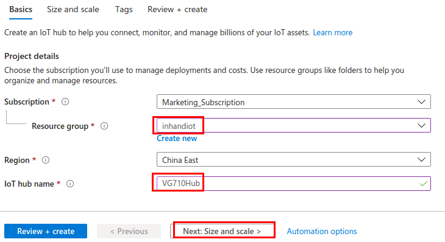

- Configure its pricing and scale

- Finally, click **create** to finish the configuration

- After successful creation, click **Go to resource** to enter IoT Hub page we created

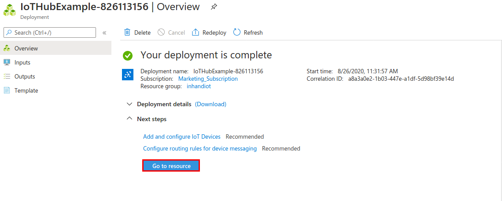

### 3.2 Create IoT Edge device

- Choose **IoT Edge**, next click **Add an IoT Edge device**  

- Configure IoT Edge device name, then click **save** to finish creation

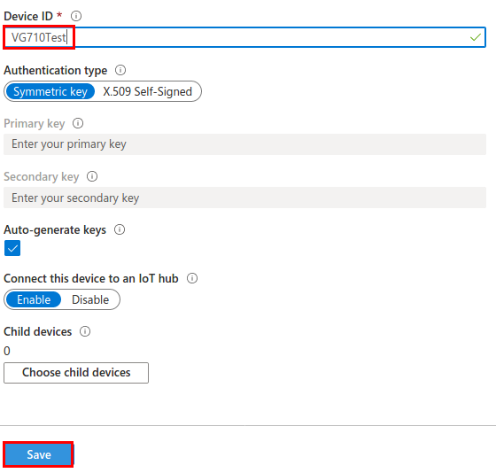

- After successful creation, record the device connection string for later use

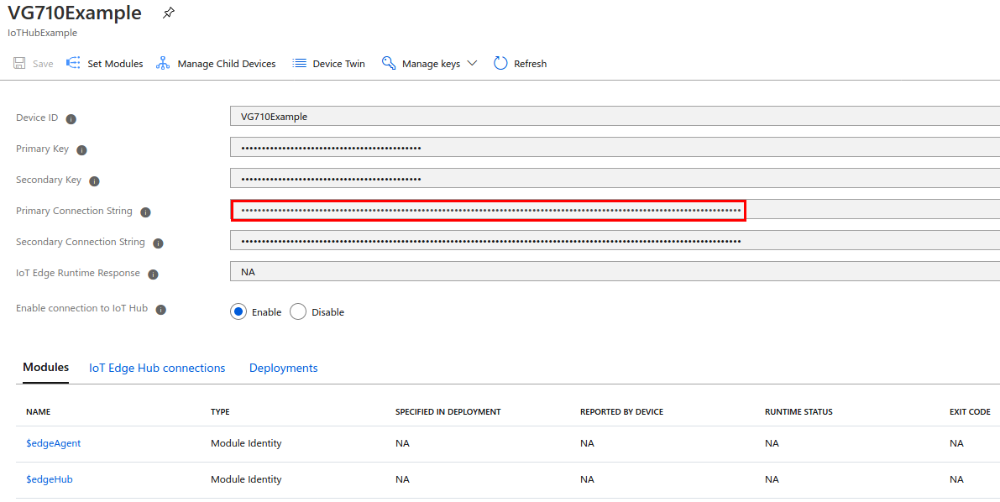

### 3.3 Configure IoT Edge device running setting

- click **Set Modules**

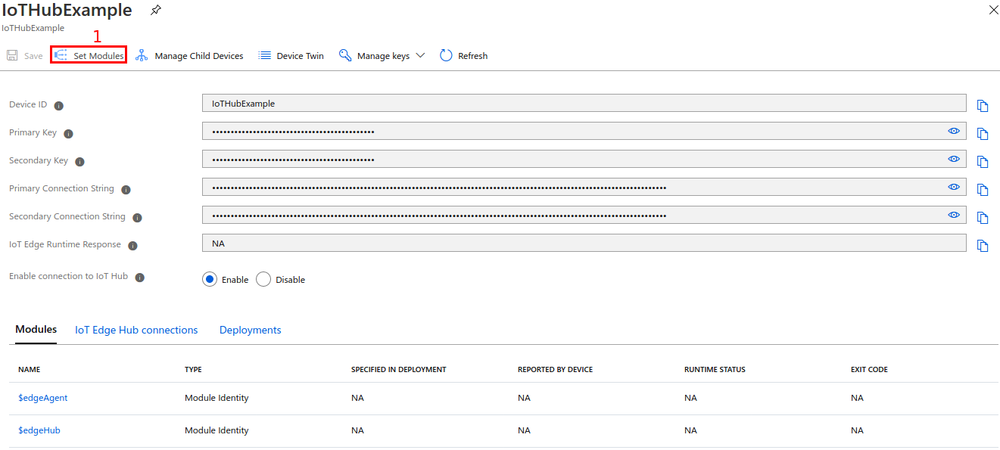

- click **Running Setting**
  - Configure Edge Hub docker image version according to our chip architecture (`mcr.microsoft.com/azureiotedge-hub:1.1.3-linux-arm32v7`)
  
- map docker container 443 port to host 8443(any unused port) port due to our web service is already using port 443
  

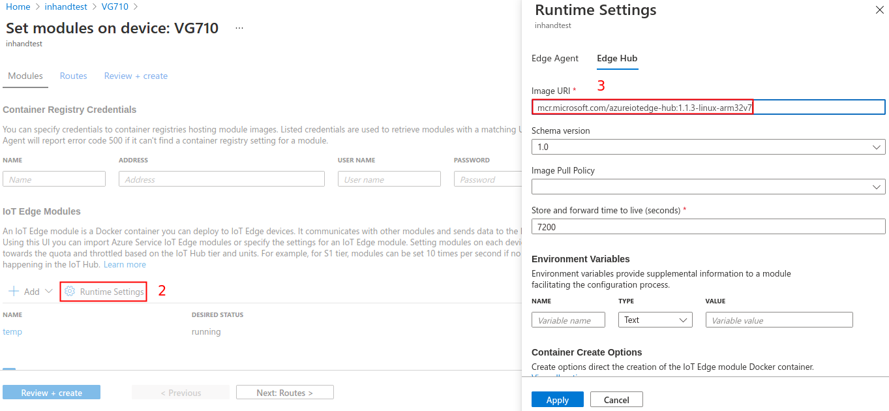

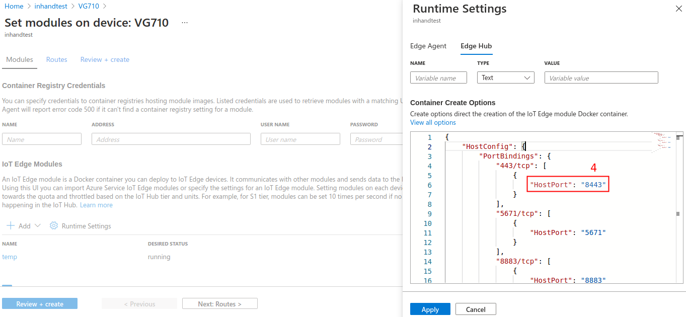

  - (**Optional**) Restrict its memory and CPU usage. Please refer to [Restrict module memory and CPU usage](https://docs.microsoft.com/en-us/azure/iot-edge/how-to-use-create-options?view=iotedge-2018-06#restrict-module-memory-and-cpu-usage) to get more detail description.

  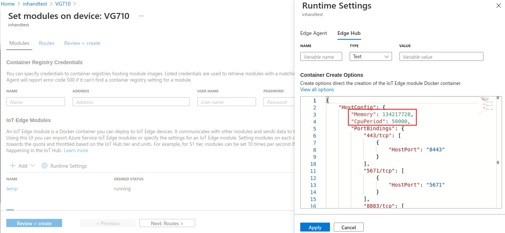

- Configure Edge Agent docker image version according to our chip architecture  (`mcr.microsoft.com/azureiotedge-agent:1.1.3-linux-arm32v7`)
  

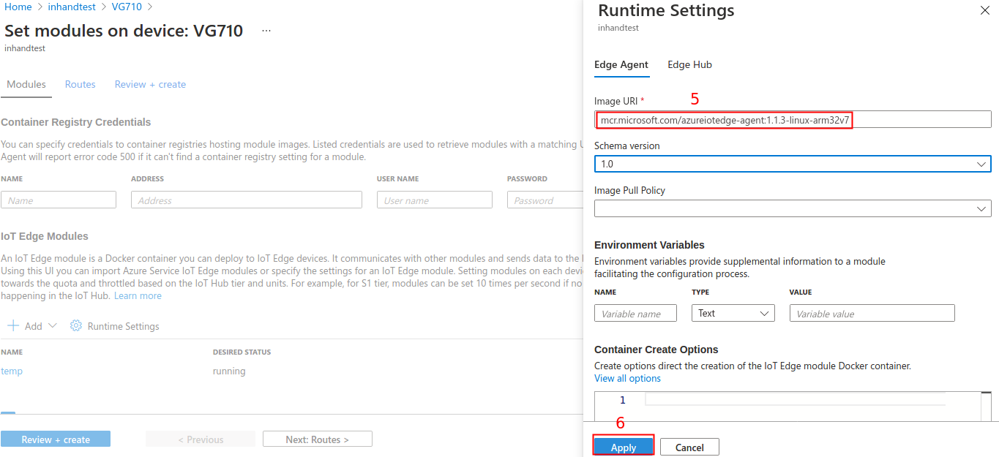

  - (**Optional**) Restrict its memory and CPU usage. Please refer to [Restrict module memory and CPU usage](https://docs.microsoft.com/en-us/azure/iot-edge/how-to-use-create-options?view=iotedge-2018-06#restrict-module-memory-and-cpu-usage) to get more detail description.

  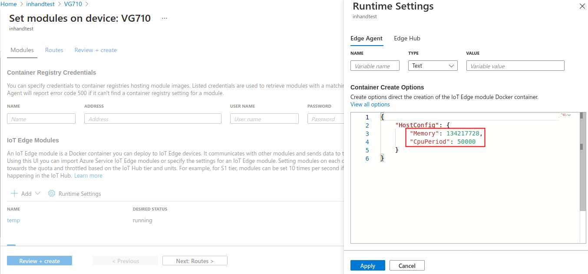

## 4. Configure VG710

**Note**: You should configure network to ensure that the device can access the Internet

### 4.1 Enable Docker

Because Azure IoT Edge Runtime is docker based, we should enable docker first. Steps are as follows:

### 4.2 Enable Azure IoT Edge

- Install Azure IoT Edge SDK

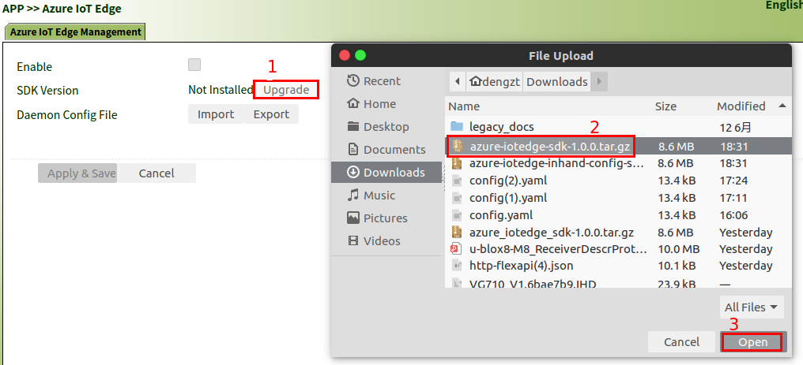

- Export Azure IoT Edge configuration file

- open configuration file, change **device_connection_string** to what we recorded above, then save and import it back.

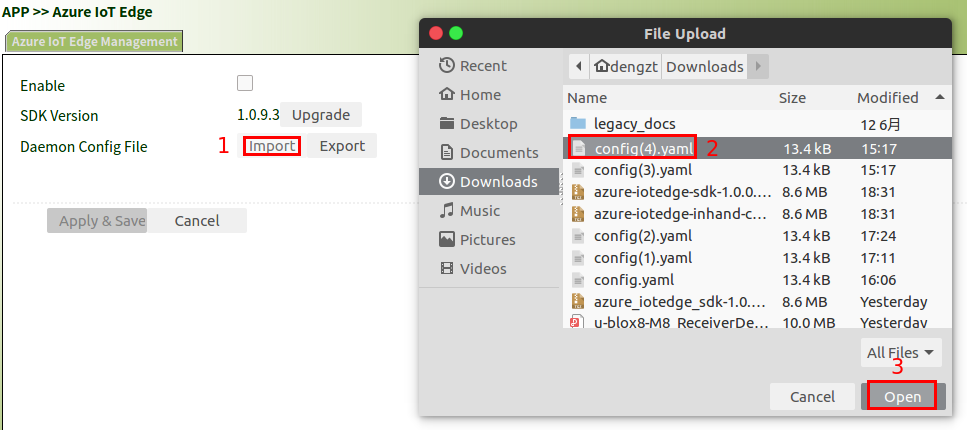

- Enable Azure IoT Edge

  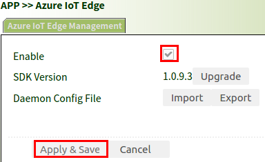

- The Azure IoT Edge daemon will pull the Agent image and create a container. The image file is large. so it will take about 5-20 minutes to complete.
You can check the container status through the Docker management page. When the Agent container is running, it means that Azure IoT Edge is already in normal working state.
  
  Steps are as follows:

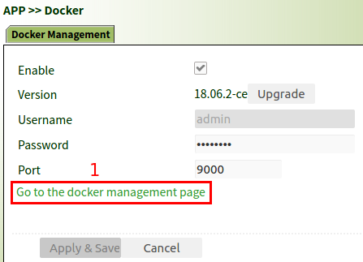

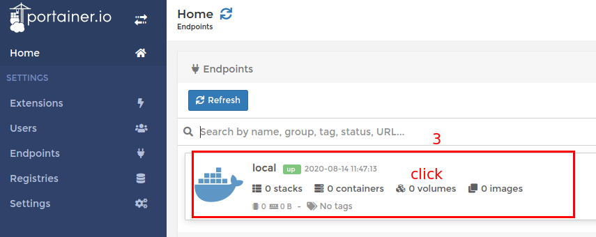

## 5. Configure and deploy the module

- In Azure IoT Edge device, click **Set Moudles**

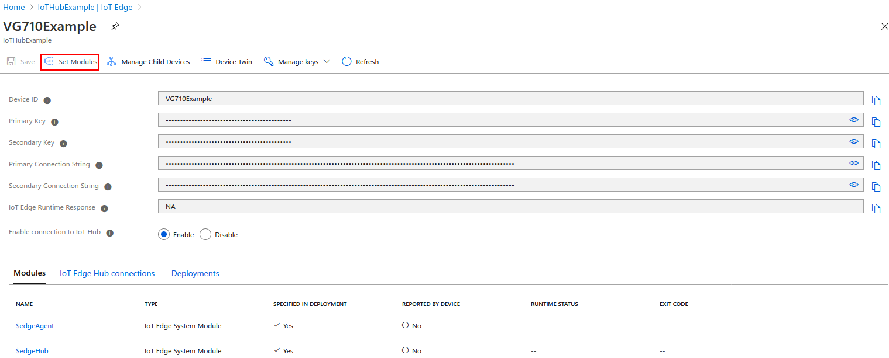

- Click **Add**, then choose **IoT Edge Module**

- Configure module name and its docker image name 

(`mcr.microsoft.com/azureiotedge-simulated-temperature-sensor:1.1.3-linux-arm32v7`)

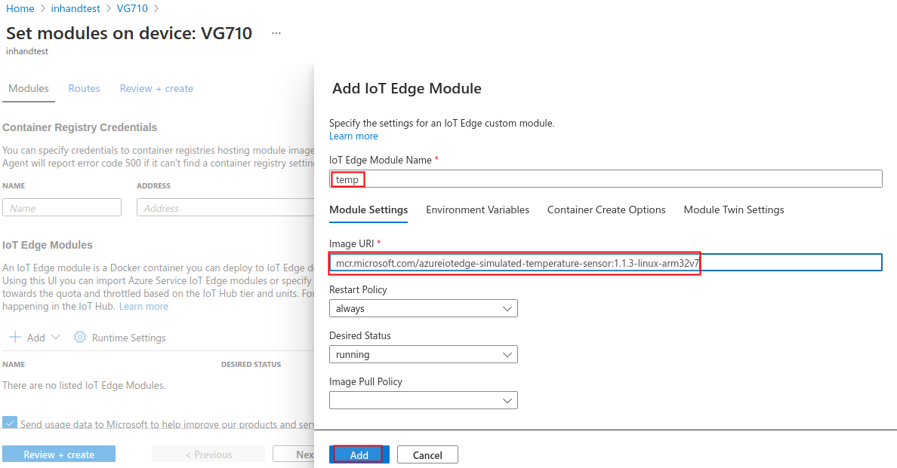

- (**Optional**) Restrict module memory and CPU usage. Please refer to [Restrict module memory and CPU usage](https://docs.microsoft.com/en-us/azure/iot-edge/how-to-use-create-options?view=iotedge-2018-06#restrict-module-memory-and-cpu-usage) to get more detail description.

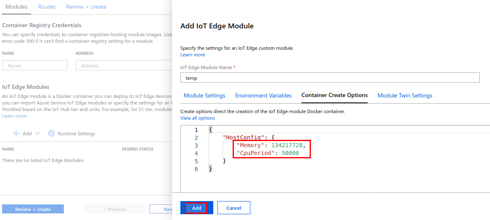

- Finally, click **Review + create** and **Create** in sequence to complete the addition.

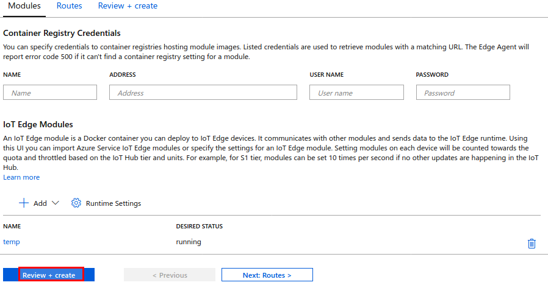

- The Azure IoT Edge daemon will pull the added module image and create a container. It will take a few minutes. 
  You can check the container status through the Docker management page as above section

- Check module status by viewing its log

